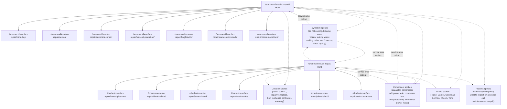

# AC Repair Topical Cluster — Strategy & Production Map

**Client:** Coastal Air Plus / coastalcarolinahvac.com
**Hubs:**
- `/summerville-sc/ac-repair/` (Summerville hub)
- `/charleston-sc/ac-repair/` (Charleston hub)
**Goal:** Move both city hubs to #1 organic + local pack for "ac repair [city]" and adjacent intents
**Prepared:** April 30, 2026

---

## Risk to acknowledge before we start

The two new hubs are going to fight for impressions with five other ranking URLs until cannibalization is resolved:

- The homepage `/` (currently ranks for both cities' head terms)
- `/summerville-sc/` and `/charleston-sc/` (city hubs)
- `/charleston-ac-repair-617782/` (legacy template stub, 884 ranking-days)
- `/summerville-sc/hvac-repair/` and `/charleston-sc/heating-repair/` (parallel service pages)
- `/air-conditioning-services/ac-repair/` (the brand-level service page)

The cluster work below builds topical authority *for the new hubs*, but until one canonical URL per intent is locked in, weekly rank reports for the head terms (`ac repair`, `air conditioning repair`) will continue to chop ±5-10 positions. The cluster lifts the ceiling. The consolidation lifts the floor. Both eventually run, in that order if Mike prefers, but the consolidation should not slip past the next 30 days or the cluster work compounds the problem.

---

## Architecture: two parallel city clusters with a shared brand-level library

Three layers:

**Layer 1 — City hubs (the two new pages):**
- `/summerville-sc/ac-repair/`
- `/charleston-sc/ac-repair/`

**Layer 2 — City-specific neighborhood spokes:**
Each hub has 6-8 neighborhood-level URLs serving long-tail local intent, mirroring the pattern that's already winning for HVAC repair (`/summerville-sc/hvac-repair/cane-bay/` ranks #1 for "hvac repair cane bay" with map presence).

**Layer 3 — Shared brand-level spokes:**
Problem/symptom, component, decision, and brand spokes live at the brand level (`/ac-repair/...` or `/blog/...`) and link down to both city hubs. These capture non-local intent and pass authority to both cities.

Solid arrows = primary internal links (parent-child). Dotted arrows = cross-link (hub to brand library; brand library back to both hubs in service-area callout block).

---

## Spoke inventory

### City-specific neighborhood spokes

**Summerville (7 spokes — mirror the existing HVAC repair pattern):**

| URL | Target query | Existing parallel? |
|---|---|---|
| `/summerville-sc/ac-repair/cane-bay/` | ac repair cane bay | yes (hvac repair version ranks #1) |
| `/summerville-sc/ac-repair/nexton/` | ac repair nexton | yes (hvac repair version ranks #1-2) |
| `/summerville-sc/ac-repair/summers-corner/` | ac repair summers corner | partial (heating only) |
| `/summerville-sc/ac-repair/wescott-plantation/` | ac repair wescott plantation | partial (duct cleaning only) |
| `/summerville-sc/ac-repair/knightsville/` | ac repair knightsville | yes (hvac repair version) |
| `/summerville-sc/ac-repair/carnes-crossroads/` | ac repair carnes crossroads | yes (hvac repair version) |
| `/summerville-sc/ac-repair/historic-downtown/` | ac repair historic downtown summerville | partial (heating only) |

**Charleston (6 spokes — net new architecture; nothing parallel exists today):**

| URL | Target query |
|---|---|
| `/charleston-sc/ac-repair/mount-pleasant/` | ac repair mount pleasant sc |
| `/charleston-sc/ac-repair/daniel-island/` | ac repair daniel island |
| `/charleston-sc/ac-repair/james-island/` | ac repair james island |
| `/charleston-sc/ac-repair/west-ashley/` | ac repair west ashley |
| `/charleston-sc/ac-repair/johns-island/` | ac repair johns island |
| `/charleston-sc/ac-repair/north-charleston/` | ac repair north charleston |

Charleston neighborhood selection should be validated against population + service-call density data Mike provides. The above is a defensible default based on Charleston metro market structure.

### Shared brand-level spokes

**Symptom / diagnostic (highest AEO value — these capture AI Overview real estate):**

| Spoke | Primary intent | AIO target |
|---|---|---|
| AC not cooling: 7 reasons and what to do | troubleshoot | yes |
| AC blowing warm air: diagnosis guide | troubleshoot | yes |
| AC frozen / iced over: causes and fixes | troubleshoot | yes |
| AC leaking water inside the house | troubleshoot | yes |
| AC making strange noises (rattle, hiss, scream, grind) | troubleshoot | yes |
| AC short cycling: why it happens | troubleshoot | yes |
| AC won't turn on: diagnostic flowchart | troubleshoot | yes |
| AC running but no air coming from vents | troubleshoot | yes |

**Component / parts:**

| Spoke | Primary intent |
|---|---|
| AC capacitor replacement: cost, signs, lifespan | informational + cost |
| AC compressor failure: signs, repair vs replace | informational + decision |
| Refrigerant leak: detection, cost, what to expect | informational + cost |
| Condenser fan motor replacement | informational |
| Evaporator coil cleaning vs replacement | informational + decision |
| Thermostat troubleshooting before calling a tech | informational + DIY |
| Blower motor problems and what they cost to fix | informational + cost |

**Decision / cost:**

| Spoke | Primary intent |
|---|---|
| AC repair cost in South Carolina (2026 ranges) | cost |
| AC repair vs replacement: a decision framework | decision |
| How long do AC units last in coastal SC humidity | informational |
| How to choose an AC repair company in the Lowcountry | trust / E-E-A-T |
| Is your AC under warranty? How to check | informational |
| Hidden costs that show up on AC repair invoices | trust |

**Brand-specific (capture branded long-tail; high commercial intent):**

| Spoke | Primary intent |
|---|---|
| Trane AC repair | branded local |
| Carrier AC repair | branded local |
| Goodman AC repair | branded local |
| Lennox AC repair | branded local |
| Rheem AC repair | branded local |
| York AC repair | branded local |

**Process / urgency:**

| Spoke | Primary intent |
|---|---|
| Same-day and emergency AC repair: what we mean | urgency / trust |
| What to expect on an AC service call | trust / E-E-A-T |
| AC maintenance vs repair: the difference and when each makes sense | informational |

Total cluster: 13 city neighborhood spokes + 28 shared spokes = 41 spokes feeding 2 hubs.

---

## Internal linking rules

**Hub pages must include:**
- "Service Areas We Cover" block listing all neighborhood spokes for that city, each as an anchor link with the neighborhood name
- "Common AC Problems We Diagnose" block linking to the top 6-8 symptom spokes
- "How AC Repair Works" sidebar/section linking to 2-3 process spokes
- A clear repair-vs-replace CTA linking to the decision spoke
- Schema: LocalBusiness + Service + AggregateRating + AreaServed (each neighborhood listed)

**Neighborhood spokes must include:**
- Breadcrumb back to city hub
- Real geographic detail (zip codes served, neighborhood landmarks, climate notes if applicable)
- A "Serving the rest of [city]" block linking to 3-4 sibling neighborhood spokes
- Schema: LocalBusiness + Service with `areaServed` set to that neighborhood

**Shared spokes must include:**
- A "Get [problem] fixed in your area" callout near the bottom that links to BOTH city hubs
- Cross-links to 2-3 related shared spokes (capacitor → compressor; not cooling → blowing warm)
- Author byline (technician name + credentials) and last-updated date
- Schema: Article + HowTo where appropriate (FAQ schema for the diagnostic/symptom spokes)

**One firm rule:** every spoke links UP to its parent hub at least twice (top of page and bottom). Every hub links DOWN to every direct-child spoke once. No deep-buried internal links.

---

## Production priority

The order matters because the early wins compound, and Charleston needs a different opening sequence than Summerville.

### Phase 1 — Foundation (weeks 1-3)

Goal: make the hubs themselves competitive before adding spokes.

Audit and reinforce both new hubs to a Service Page SOP v1.1 standard. Specific items:

- Real photos from Coastal jobs (no stock)
- Technician bios with credentials, years experience, certifications
- 6-8 verified Google reviews embedded with permission
- City-specific climate / housing-stock paragraph (Charleston coastal humidity / older housing stock; Summerville inland heat / new construction subdivisions)
- Pricing transparency block (diagnostic fee, common repair ranges, financing)
- Service area block (neighborhoods served, even before spokes are built)
- Same-day/emergency service guarantee with response-time data
- Schema markup as listed above

This is also where the Citation Discipline overlay (per the agency cross-cutting SOP) gets applied: any stat on these pages needs a verified source and inline hook.

### Phase 2 — Summerville neighborhood spokes (weeks 4-7)

Summerville first, because:
- The hub is closer to page 1 already (current rank 22 on the new URL, but `ac repair summerville sc` is rank 24 on the city hub with movement)
- The HVAC-repair neighborhood pattern is proven there — the spokes should rank within 3-4 weeks
- Existing internal linking infrastructure (the city hub already passes authority to neighborhood pages)

Production order: Cane Bay, Nexton, Carnes Crossroads first (highest population growth, validated demand). Then Knightsville, Wescott Plantation, Summers Corner, Historic Downtown.

### Phase 3 — Charleston neighborhood spokes (weeks 5-9, overlapping Summerville)

Charleston neighborhoods need more groundwork because no parallel architecture exists. Two prep tasks before drafting:

1. Validate the 6 neighborhood candidates against actual service-call data from Mike. The list above is reasonable but not authoritative.
2. Build a Charleston-specific GBP service area extension to match the spoke geography (one of the open items from the rank review).

Production order will be determined by the validation step.

### Phase 4 — Highest-AEO symptom spokes (weeks 6-10, overlapping)

The eight symptom/diagnostic spokes are the AEO opportunity. Ship in this order based on search volume × AIO presence × intent quality:

1. AC not cooling: 7 reasons and what to do
2. AC blowing warm air: diagnosis guide
3. AC won't turn on: diagnostic flowchart
4. AC frozen / iced over: causes and fixes
5. AC leaking water inside the house
6. AC making strange noises
7. AC short cycling: why it happens
8. AC running but no air coming from vents

Validate with `tool-dataforseo` SERP advanced before drafting each one — Casey Keith's entity SEO method requires confirming the AIO citation set is HVAC content (not, say, automotive AC, which has overlap on some of these queries).

### Phase 5 — Decision and component spokes (weeks 8-14)

Component spokes feed into the symptom spokes and the hubs. Decision spokes (especially "AC repair vs replacement") bridge into the Replacement category that's already winning in the rank data.

Sequence: AC repair cost in SC → AC repair vs replacement → AC capacitor → AC compressor → Refrigerant leak → remaining components → "How to choose an AC repair company."

### Phase 6 — Brand and process spokes (weeks 12-18)

Lowest priority, longest tail. Build them after the higher-leverage spokes are deployed. The "what to expect on a service call" and "same-day repair: what we mean" pieces are useful trust assets even if their search volume is modest.

---

## AEO / AI Overview opportunities embedded in this cluster

The SE Ranking export shows AI Overview present on `hvac maintenance` Summerville right now. Likely AIO-presence on more terms within the priority cohort once we look. The symptom/diagnostic spokes are the strongest AEO plays because:

- They answer specific, well-formed questions ("why is my AC not cooling")
- The AIO citation pattern for HVAC favors content with structured diagnostic steps
- Coastal Carolina HVAC has technician-authored credibility that AIO algorithms reward over generic content farms

Per `str-ai-seo` skill (Casey Keith entity SEO method), each symptom spoke should be drafted with:
- Entity-rich opening paragraph naming the system, the symptom, the most likely cause cluster
- Diagnostic flowchart in HowTo schema
- Cited specifications from manufacturer service manuals (Trane, Carrier, Goodman) and EPA refrigerant guidelines where relevant
- Local-trust signals (technician byline, service area mention, license number)

The AEO play is independent of and additive to the local-pack play. AIO citations don't require the local pack; the local pack doesn't depend on AIO.

---

## Open questions for Mike before production starts

1. Charleston neighborhood validation: which neighborhoods generate the most service calls? The default list (Mount Pleasant, Daniel Island, James Island, West Ashley, Johns Island, North Charleston) needs his confirmation.
2. Brand-specific spoke priority: which AC brands does Coastal service most? The list of six (Trane, Carrier, Goodman, Lennox, Rheem, York) is a reasonable default but should be ordered by actual service-mix data.
3. Pricing transparency: does Coastal want public price ranges on the hubs, or "call for estimate" only? Industry trend is toward ranges; Mike's call.
4. Reviews: how many verified, recent (last 90 days) Google reviews are available for each city? This shapes the social-proof block on each hub.
5. Photo assets: how many real-job photos exist for each city? If thin, the photo capture is a separate work item to schedule.

---

## Suggested next Claude Code session

Working folder: `clients/coastal-air-plus/`
Branch: `feature/coastal-ac-repair-cluster-2026-04` (or `jordan/coastal-air-plus/ac-repair-cluster-2026-04` if Jordan runs it)

Session scope:
- Save this strategy doc and the Mermaid diagram into `clients/coastal-air-plus/projects/ac-repair-cluster-2026-04/`
- Run `tool-dataforseo` keyword validation on the symptom-spoke list (8 keywords) and brand-spoke list (6 keywords) to lock priority order
- Run `tool-dataforseo` SERP advanced on the top 4 symptom spokes to confirm HVAC intent vs. competing intents (automotive AC etc.)
- Audit the two new hub pages against the Agency Service Page SOP v1.1 and produce a gap report
- Pause for Jason's review before drafting begins

Do not auto-commit. Open as a PR.

---

## What this cluster will and won't do

It will:
- Build topical authority around "AC repair in [city]" that supports both head-term and long-tail rankings
- Feed AIO citations on diagnostic queries
- Capture local long-tail through the neighborhood spokes (proven pattern from the HVAC repair cluster)
- Bridge into the Replacement category through the repair-vs-replace decision spoke

It won't:
- Move the head terms (`ac repair`, `air conditioning repair`) to #1 organically without the cannibalization consolidation also being done
- Get Coastal into the local pack — that's a Google Business Profile and citation-consistency project, not a content project
- Compete with the legacy `/charleston-ac-repair-617782/` template stub until that page is redirected or canonicalized to the new hub

The local pack, the consolidation, and the cluster are three parallel workstreams. The cluster is what we're starting now. The other two should not slip past 30 days.
